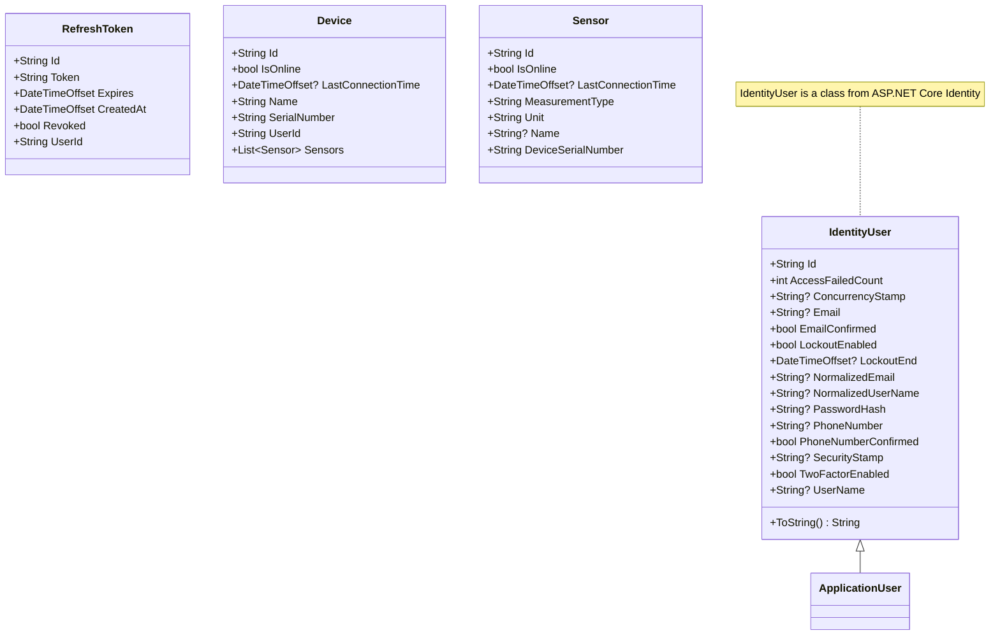
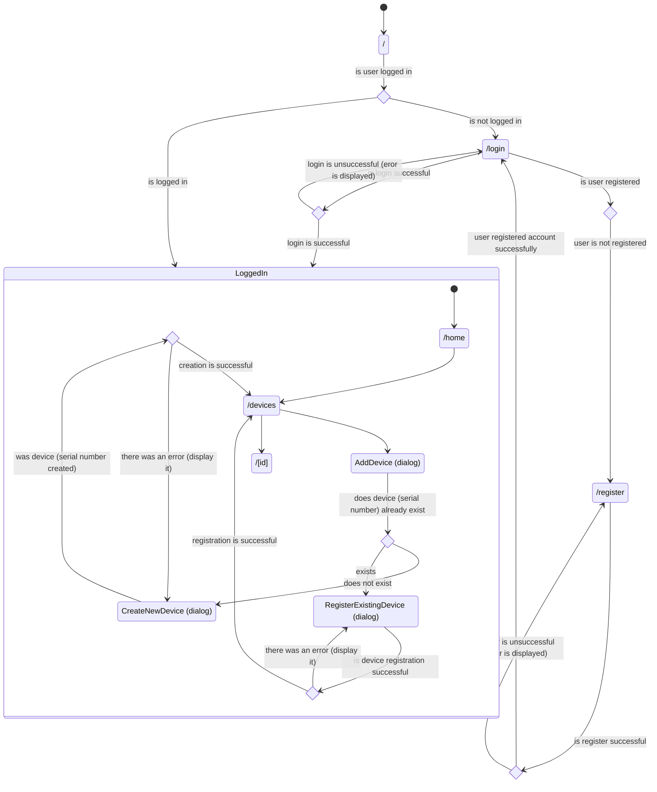

# IoT Device Manager

## Application Overview

This app is meant as an application where you can manage your IoT devices/products.
Current vision includes creation and registering of devices, and then displaying some
basic info about the device and its sensors.

## Running the project locally

Docker is the most obvious requirement for this project. Docker is used with Docker Compose to
orchestrate the different containers. The containers include .NET Web API, MSSQL Server, React
frontend (with Nginx), Angular frontend (with Nginx) and a separate Nginx container for proxy.
Once you have cloned the project, the .NET Web API and Docker require some environment variables.
The application is developed with VS (and VS Code) on Windows.

### Cloning the project

You can clone the project to your desired path with the command
```
git clone https://github.com/paavkar/IoTDeviceManager.git
```

### Environment variables

Docker needs a .env file in the project root with at least the following key-value pairs:
```
DB_CONNECTION_DEV=<INSERT_YOUR_DEV_DB_CONNECTION_STRING>
DB_CONNECTION=<INSERT_YOUR_DB_CONNECTION_STRING>
DatabasePassword=<INSERT_YOUR_DB_PASSWORD>
```
DB_CONNECTION is used in the file docker-compose.prod.yml, if you so choose (NOTE! There
are no actual production containers or container registries for this project currently.)

The .NET Web API requires the following environment variables:
```
"Kestrel:Certificates:Development:Password":<YOUR_PASSOWRD>,
"Jwt:Key":<YOUR_SECRET_KEY>,
"Jwt:Issuer":<YOUR_JWT_ISSUER>,
"Jwt:ExpireMinutes":<JWT_ACCESS_TOKEN_EXPIRY_TIME>,
"Jwt:ExpireDays":<REFRESH_TOKEN_EXPIRY_TIME>,
"Jwt:Audience":<YOUR_JWT_AUDIENCE>,
"ConnectionStrings:DefaultConnection":<YOUR_DB_CONNECTION_STRING>
```
The above formatting is if you use User Secrets (secrets.json) in .NET projects.
The JWT secret key (Jwt:Key) needs to be at least 256 bits long.

## Diagrams

### Class Diagrams



### State Diagrams

This diagram displays the flow of application usage from being logged out and not having an account
to being logged in.

