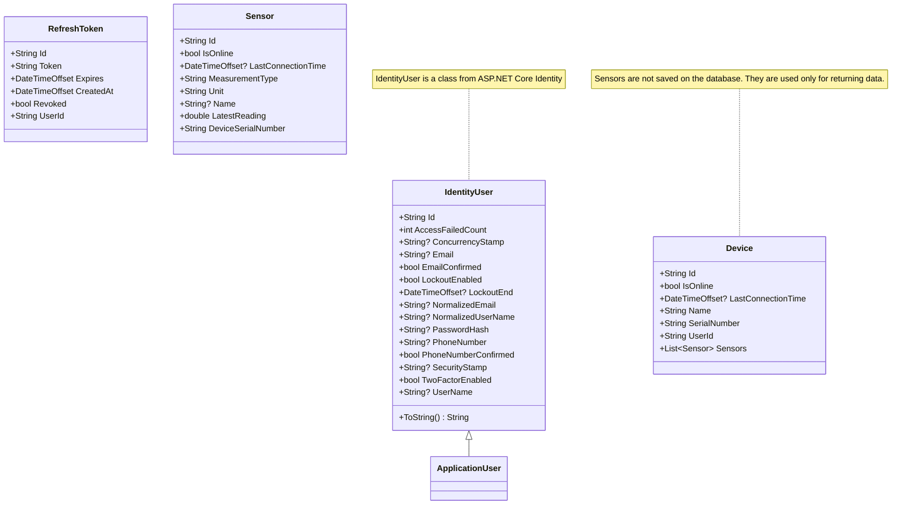
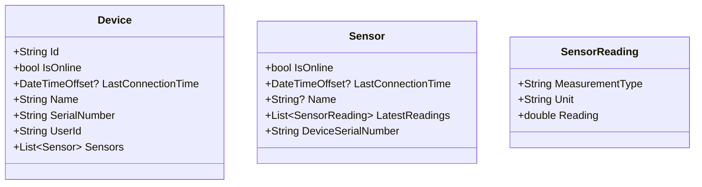
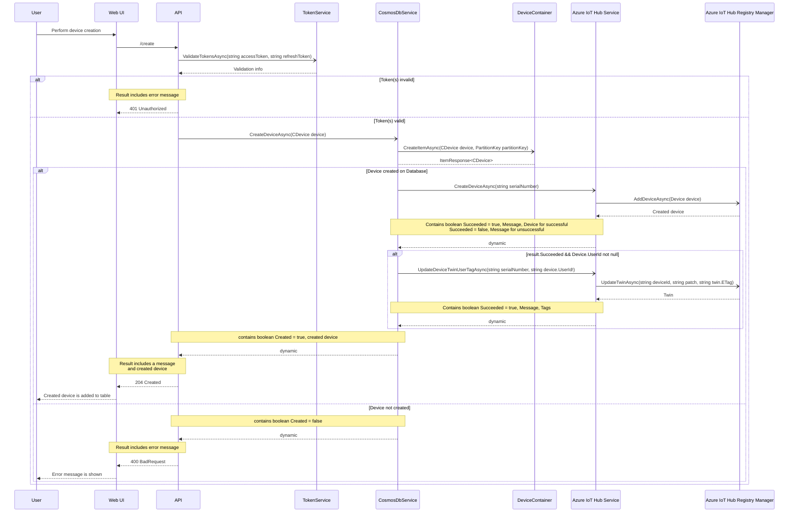
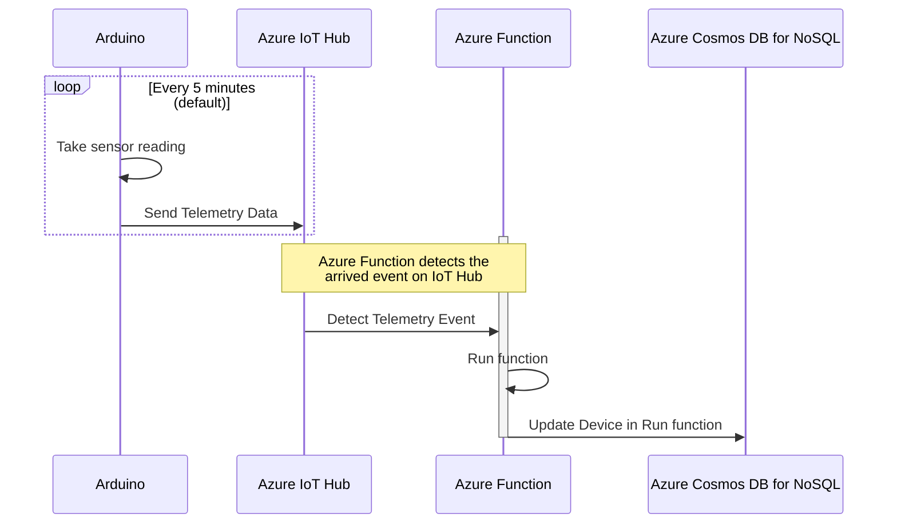
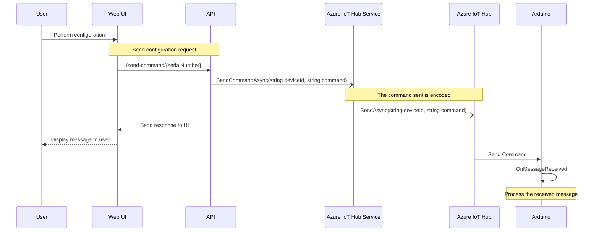

# IoT Device Manager

## Application Overview

This app is meant as an application where you can manage your IoT devices/products.
Current vision includes creation and registering of devices, and then displaying some
basic info about the device and its sensors.

## Running the project locally

Docker is the most obvious requirement for this project. Docker is used with Docker Compose to
orchestrate the different containers. The containers include .NET Web API, MSSQL Server, React
frontend (with Nginx), Angular frontend (with Nginx) and a separate Nginx container for proxy.
Once you have cloned the project, the .NET Web API and Docker require some environment variables.
The application is developed with VS (and VS Code) on Windows.

### Cloning the project

You can clone the project to your desired path with the command
```
git clone https://github.com/paavkar/IoTDeviceManager.git
```

### Environment variables

Docker needs a .env file in the project root with at least the following key-value pairs:
```
DB_CONNECTION_DEV=<INSERT_YOUR_DEV_DB_CONNECTION_STRING>
DB_CONNECTION=<INSERT_YOUR_DB_CONNECTION_STRING>
DatabasePassword=<INSERT_YOUR_DB_PASSWORD>
```
DB_CONNECTION is used in the file docker-compose.prod.yml, if you so choose (NOTE! There
are no actual production containers or container registries for this project currently.)

The .NET Web API requires the following environment variables:
```
"Kestrel:Certificates:Development:Password":<YOUR_PASSOWRD>,
"Jwt:Key":<YOUR_SECRET_KEY>,
"Jwt:Issuer":<YOUR_JWT_ISSUER>,
"Jwt:ExpireMinutes":<JWT_ACCESS_TOKEN_EXPIRY_TIME>,
"Jwt:ExpireDays":<REFRESH_TOKEN_EXPIRY_TIME>,
"Jwt:Audience":<YOUR_JWT_AUDIENCE>,
"ConnectionStrings:DefaultConnection":<YOUR_DB_CONNECTION_STRING>
```
The above formatting is if you use User Secrets (secrets.json) in .NET projects.
The JWT secret key (Jwt:Key) needs to be at least 256 bits long.

## Diagrams

### Class Diagrams

These classes are saved on the SQL Server database, with the attributes that are displayed.



A better approach for data storage would be to at least save the device information on a document-based
database such as Azure Cosmos DB for NoSQL. As Identity doesn't inherently support it, user accounts could
still be stored on SQL Server database. When using this combination, the following structure could be used.



This would create the following JSON-document on the database:

```
"id": <STRING_VALUE>,
"isOnline": <FALSE_OR_TRUE>,
"lastConnectionTime": <DateTimeOffset_OF_LATEST_CONNECTION>,
"name": <GIVEN_NAME_FOR_THE_DEVICE_BY_USER>,
"serialNumber": <GENERATED_SERIALNUMBER>,
"userId": <ID_OF_THE_USER_WHO_CREATED>,
"type": <STRING_VALUE>,
"partitionKey": <STRING_VALUE>,
"sensors": [
    {
        "isOnline": <FALSE_OR_TRUE>,
        "lastConnectionTime": <DateTimeOffset_OF_LATEST_SENSOR_CONNECTION>,
        "name": <NAME_OF_THE_SENSOR_FROM_DEVICE_SOFTWARE>,
        "latestReadings": [
            {
                "measurementType": <TYPE_OF_MEASUREMENT>,
                "unit": <UNIT_OF_MEASUREMENT>,
                "reading": <READING_FROM_SENSOR>
            }
        ]
    },...
]
```

This kind of setup would allow easier packaging of devices and its sensors. Multiple sensors
are possible with SQL Server, but the benefit of this is to have one sensor for all of the types
of data it measures. For example, an SHT-sensor measures both temperature and humidity, in this
setup, you can save the different form of measurements in the latestReadings array for that
particular sensor.

The before explained format is now deployed with the v2 API. With this structure, the sensor
readings are sent to the database via Azure IoT Hub. When the IoT Hub receives telemetry (sensor)
data, an Azure Function is used to save the data on the database. The Azure Function code is available
in this repository, and the example of how to communicate with Azure IoT Hub is available at
[EmbeddedProjects | AzureIoTHub](https://github.com/paavkar/EmbeddedProjects/tree/main/AzureIoTHub).
The code for IoT Hub communication is largely the same as Microsoft's example code.

### State Diagrams

This diagram displays the flow of application usage from being logged out and not having an account
to being logged in.


### Sequence Diagrams

#### Device Creation flow

The following diagram displays the flow of user creating a device from the Web UI



#### Arduino sensor measurement -> DB flow

The following diagram is supposed to communicate the flow of Arduino using its sensor(s) to
take readings and then send the data to Azure IoT Hub, upon which Azure Function detects
this event and int its function called "Run" updates the device on Azure Cosmos DB for NoSQL.
User can configure the loop frequency, as in the default is every 5 minutes (current minute % 5 == 0).


#### Cloud to Device message flow

The following diagram displays the flow of user being on the device page and choosing
configuration message. The message is sent to the API, which in turn uses a service that
communicates with Azure IoT Hub to send commands to a device that is registered.


## App Usage

To use the application, you first need to register, and then login. After logging in, you can create
a device with a name. Creating a device saves a device with your given name, and a serial number is
generated for it. Your devices are displayed in the devices page.

To send data from your IoT device, you need the serial number of your created device. Sending data is based on the
different sensors and what they measure. As an example, if your device has an SHT-sensor that measures
both temperature and humidity, these measurement types would count as different sensors.

You can see an example of how to send data using an Arduino-based board with different sensors here:
[GitHub | EmbeddedProjects](https://github.com/paavkar/EmbeddedProjects/blob/main/IoTServices/src/main.cpp).

To test the API locally, you send the request to ``<APPLICATION_HOST_IP>/api/v1/Device/<DEVICE_SERIAL_NUMBER>``.
Depending on your embedded setup, your configuration could differ. If you use similar setup with ArduinoHttpClient
as I have used (see link), you should have minimal issues. NOTE on ArduinoHttpClient: you don't need to manually add
http:// before the IP.

The API expects a request body of following key-value pairs:
```
name: <YOUR_NAME_FOR_THE_SENSOR>,
measurementType: <WHAT_IS_MEASURED>,
unit: <UNIT_OF_MEASUREMENT>,
latestReading: <THE_LATEST_READING_FROM_SENSOR>
```
The following is an example of values:
```
name: shtc3_temp,
measurementType: Temperature,
unit: C,
latestReading: 23.1
```
If you want to use the newer Azure Cosmos DB based solution, send the request to the v2 endpoint.