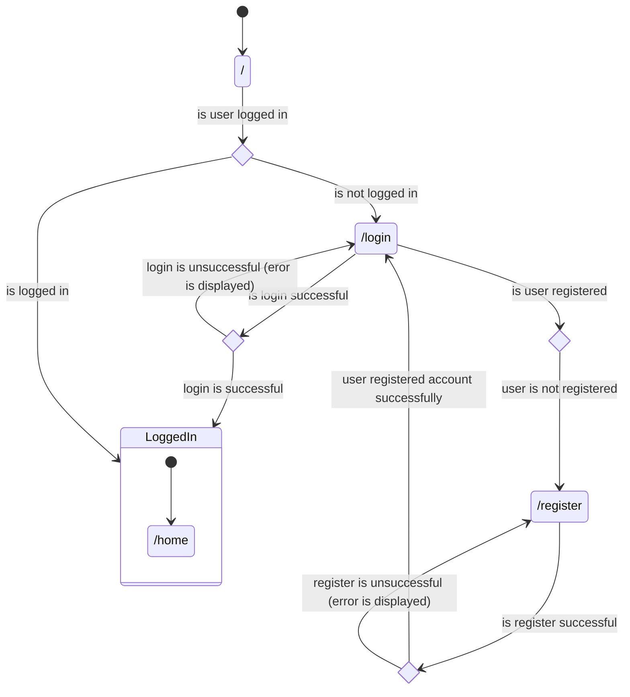

# IoT Device Manager

## Application Overview

This app is meant as an application where you can manage your IoT devices/products.

This app is set up with Docker containers. Docker Compose is used to orchestrate to starting of the needed containers.
There are three containers in total, one for the database (Microsoft SQL Server), one for the backend (.NET),
and finally one for the frontend (React). The React frontend's Dockerfile is set up to build the project files
and then serve them with Nginx.

## Diagrams

### Class Diagrams

### State Diagrams

This diagram displays the flow of application usage from being logged out and not having an account
to being logged in.

